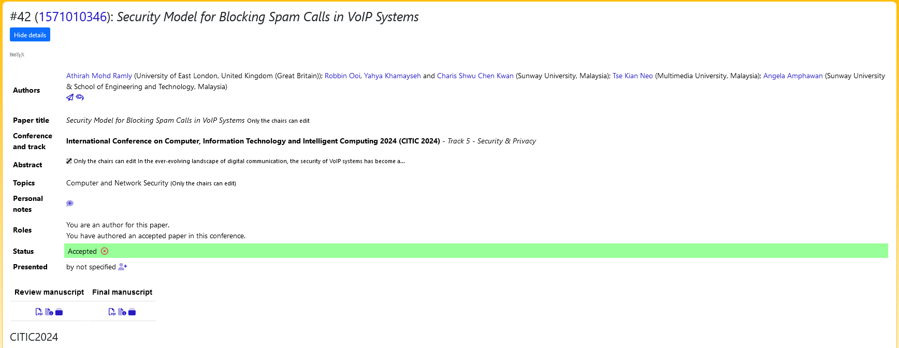

# Analysis on Cyber Threats and Attacks in VoIP Systems

For my final year project, I conducted research on VoIP security and proposed a light-weight security model within Asterisk PBX to mitigate spam calls. This research was also officially presented on CITIC 2024 Track 5 - Security & Privacy.

